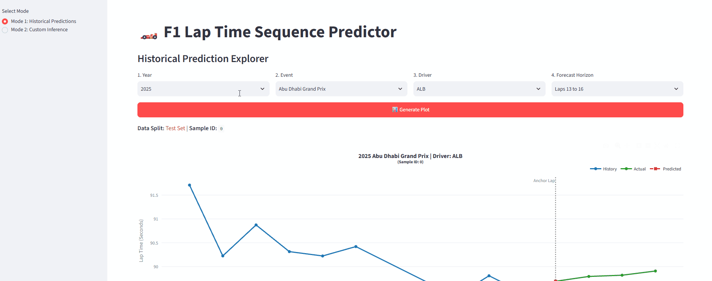
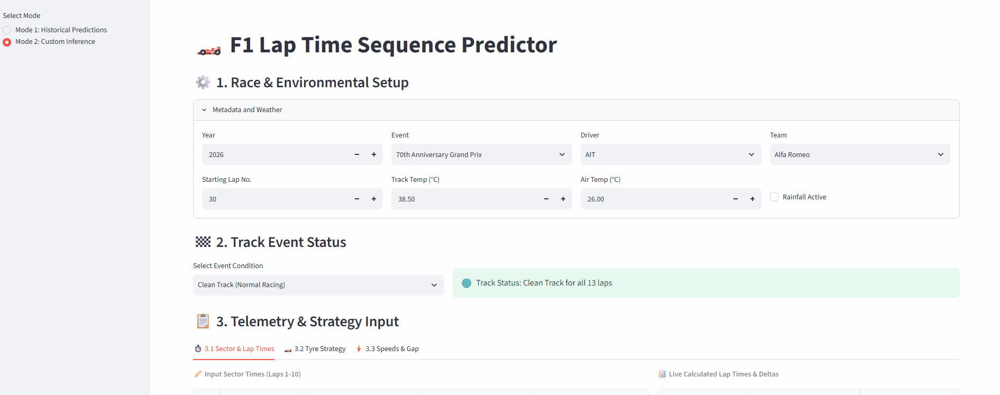
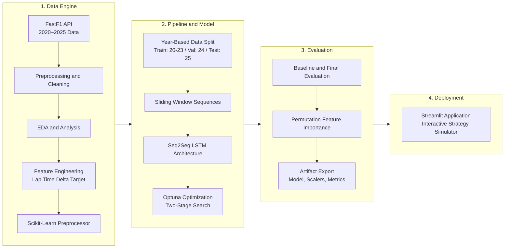
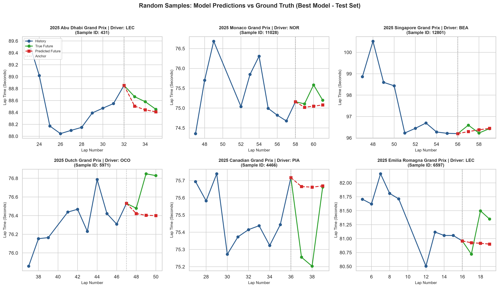
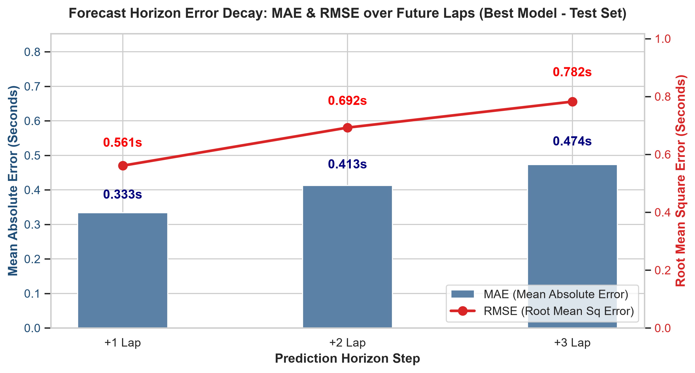
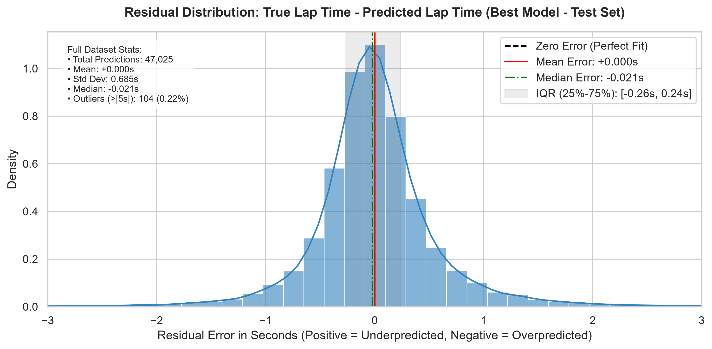
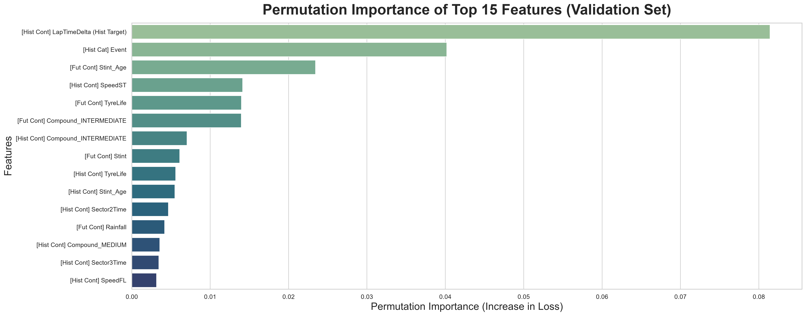

# F1 Lap Time Prediction with a LSTM Model

## Overview

An end-to-end deep learning framework and interactive Streamlit web application designed to forecast Formula 1 multi-lap sequence times. Powered by an autoregressive PyTorch Seq2Seq LSTM model, the system models race dynamics—including tyre degradation, sector splits, telemetry data, and dynamic track conditions—to deliver real-time lap time predictions.


> For in-depth details for Exploratory Data Analysis (EDA), Model Selection and Tuning, and Results, please refer to the [Full Technical Report](f1_lap_time_report.md).

---

## Demo

### Mode 1 : Historical Data Evaluation


### Mode 2 : Custom Inference



**Try the Live Interactive Web App:** [F1 Lap Time Sequence Predictor on Streamlit Cloud](https://f1-lap-time-predictor-gs5gqwdd2olw8atxa35cwj.streamlit.app)

---

## Key Features & Highlights



---

## Key Results

Evaluation on unseen 2025 test telemetry demonstrates multi-lap forecasting characteristics and variance limits.

### Multi-Lap Forecast Profiles

<p align="center">
  
</p>

* **Trend vs. Volatility:** The model captures macro lap-time trends, but struggles with short-term oscillating pace fluctuations and sudden spikes driven by unmodeled traffic dynamics.

### Forecast Horizon Error Decay

<p align="center">
  
</p>

* **Horizon Degradation:** Error scales predictably across the 3-lap window—MAE rises from **0.333s** (+1 lap) to **0.474s** (+3 laps), while RMSE grows from **0.561s** to **0.782s**.

### Residual Distribution

<p align="center">
  
</p>

* **Zero-Bias Center:** Predictions show zero overall systematic bias (mean error **+0.000s**, median **-0.021s**) across **47,025 evaluation laps**, with 50% of residuals bound within **[-0.26s, +0.24s]**.

### Feature Importance

<p align="center">
  
</p>

* **Dominant Signals:** Historical `LapTimeDelta` and categorical `Event` provide the highest predictive power, followed by tyre strategy characteristics (`Stint_Age` and `TyreLife`), while speed traps and sector split times provide smaller secondary contributions.

---

## Tech Stack

* **Language:** Python `3.12.11`
* **Data Collection and Analysis:** fastf1, Pandas, NumPy
* **Data Preprocessing Pipeline:** Scikit-learn
* **Deep Learning and Tuning:** PyTorch, Optuna
* **Visualization:** Matplotlib, Seaborn, plotly
* **Model Persistence:** Joblib
* **Web Framework:** Streamlit

---

## Project Structure

```text
f1-lap-time-predictor/
├── assets/                         # Demonstration GIFs for README
├── src/                            # Model and preprocessor scripts
├── f1_lap_time_prediction.ipynb    # Complete Machine Learning pipeline
├── f1_lap_time_report.md           # Comprehensive technical report
├── app.py                          # Interactive Streamlit web application
├── requirements.txt                # Python dependencies
└── README.md                       # Project documentation
```

The execution pipeline automatically generates and manages the following runtime directories:

```text
├── f1_data_cache               # Data Cache for fastf1 API
├── f1_data_raw                 # raw data in CSV
├── models/                     # Stores trained model weight and config
├── results                     # Prediction and evaluation results
└── plots/                      # Generated visualizations
    ├── Base_Model              # Visualizations of evaluation of Base Model
    ├── Best_Model              # Visualizations of evaluation of Best Model
    ├── EDA/                    # Exploratory Data Analysis plots
    ├── Preprocessing           # Visualizations of the preprocessed data
    └── Feature_Importance      # Feature importance visualizations
```

---

## How to Run

First clone the repository:
```bash
git clone https://github.com/BevisWong76/f1-lap-time-predictor.git
cd f1-lap-time-predictor
```

You can then set up the project locally using either the standard Python `venv` or the ultra-fast `uv` package manager.

### Option 1: Using Standard Python `venv` (Traditional)

1. Create a virtual environment:
```bash
python -m venv .venv
```

2. Activate the virtual environment:
```bash
# Windows (Command Prompt):
.venv\Scripts\activate.bat

# Windows (PowerShell):
.venv\Scripts\Activate.ps1

# macOS / Linux:
source .venv/bin/activate
```

3. Install dependencies:
```bash
pip install --upgrade pip
pip install -r requirements.txt
```

### Option 2: Using `uv` (Recommended for Speed)

`uv` is an extremely fast Python package installer and resolver written in Rust.

1. Install `uv` (if you haven't already):
```bash
pip install uv
```

2.  Create a virtual environment:

```bash
uv venv
```

3. Activate the virtual environment:
```bash
# Windows (Command Prompt):
.venv\Scripts\activate.bat

# Windows (PowerShell):
.venv\Scripts\Activate.ps1

# macOS / Linux:
source .venv/bin/activate
```

 4. Install dependencies:
```bash
uv pip install --upgrade pip
uv pip install -r requirements.txt
```

### Run the Streamlit App

Once the dependencies are installed and the model artifacts are generated, launch the interactive web application:

```bash
streamlit run app.py
```