# Formula 1 Multi-Lap Time Forecasting Report

## Table of Contents
* [Executive Summary](#executive-summary)
* [1. Data Pipeline & Preprocessing](#1-data-pipeline--preprocessing)
* [2. Exploratory Data Analysis (EDA)](#2-exploratory-data-analysis-eda)
* [3. Feature Engineering & Preprocessing Architecture](#3-feature-engineering--preprocessing-architecture)
* [4. Sequence Modelling & Experimental Design](#4-sequence-modeling--experimental-design)
* [5. Baseline Model Performance & Evaluation](#5-baseline-model-performance--evaluation)
* [6. Hyperparameter Optimization (Optuna)](#6-hyperparameter-optimization-optuna)
* [7. Tuned Model Evaluation & Results](#7-tuned-model-evaluation--results)
* [8. Feature Importance Analysis](#8-feature-importance-analysis)
* [9. Deployment & Application Architecture](#9-deployment--application-architecture)
* [10. Discussion & Future Improvements](#10-discussion--future-improvements)

---

## Executive Summary

This project develops an end-to-end deep learning framework and interactive Streamlit web application to forecast Formula 1 multi-lap sequence times across dynamic race conditions. Leveraging an autoregressive **Seq2Seq LSTM architecture** built in PyTorch, the system predicts sequence lap time deltas up to 3 laps into the future by modeling high-dimensional telemetry, tyre degradation curves, sector splits, weather metrics, and strategic feature inputs.

### Core Architecture & Strategy
* **Data Foundation:** Multi-year telemetry spanning 2020–2025 sourced via the [FastF1 API](https://github.com/theOehrly/Fast-F1), cleaned and preprocessed using Scikit-Learn pipelines.
* **Leakage-Free Splitting:** Strict year-based chronological split (Train: 2020–2023, Validation: 2024, Test: 2025) to evaluate true out-of-sample race generalization.
* **Two-Stage Hyperparameter Search:** Automated coarse-to-fine tuning powered by Optuna to optimize embedding dimensions, LSTM depth, and loss regularization.

### Primary Results on 2025 Test Set
* **High-Precision Horizon:** Achieves a **0.333s MAE** (0.561s RMSE) on immediate $+1$ lap forecasts, scaling gracefully to **0.474s MAE** (0.782s RMSE) at $+3$ laps.
* **Unbiased Residual Distribution:** Center-aligned error profile across 47,025 evaluation predictions with a mean error of **+0.000s** (median **-0.021s**), with 50% of predictions bound within an IQR of **[-0.26s, +0.24s]**.
* **Key Predictive Drivers:** Permutation importance identifies historical `LapTimeDelta` and race `Event` as dominant primary signals, supported by future strategy inputs (`Stint_Age` and `TyreLife`).

---

## 1. Data Pipeline & Preprocessing

### 1.1 Data Ingestion
Telemetry and lap data spanning the 2020–2025 Formula 1 seasons are collected via the FastF1 API. Official pre-season testing sessions are explicitly excluded to focus exclusively on competitive Grand Prix weekend dynamics.

### 1.2 Telemetry Cleaning & Quality Control
Raw telemetry requires strict quality control filtering and schema standardization prior to sequence formation:
* **Time Conversion:** Timing strings (`LapTime`, `Sector1Time`, `Sector2Time`, `Sector3Time`) are converted to standard floating-point seconds using `pd.to_timedelta`.
* **Weather Data Imputation:** Environmental variables (`AirTemp`, `Rainfall`) are numericized, interpolated linearly, and forward/backward filled to handle missing sensor records.
* **Inaccurate & Deleted Laps:** Laps flagged as inaccurate (`IsAccurate == False`) or deleted by race control due to track limit violations (`Deleted == True`) are filtered out.
* **Pit Lane Sequences:** Laps containing pit entry or pit exit events (`PitInTime` or `PitOutTime`) are removed to prevent non-representative slow-lap noise from distorting model training.

### 1.3 Track Status Encoding
The raw FastF1 `TrackStatus` bitmask is decoded into 4 distinct binary flags using bitwise `AND` operators:
* `IsYellowFlag` (Bit $2^1$)
* `IsSafetyCar` (Bit $2^2$)
* `IsRedFlag` (Bit $2^3$)
* `IsVSC` (Bit $2^4$)

Missing track status values default to `1` (Green/Clear track).

### 1.4 Group-wise Outlier Removal
Outliers across key numerical features (`LapTimeSeconds`, sector times, and speed trap metrics `SpeedI1`, `SpeedI2`, `SpeedFL`, `SpeedST`) are handled conditionally:
* Reference mean ($\mu$) and standard deviation ($\sigma$) statistics are calculated strictly within each `[Year, Event]` group on "Clean Track" laps (where no flags or safety cars occurred).
* For clean laps, records outside $\mu \pm 3\sigma$ are pruned to eliminate severe driver mistakes or unflagged traffic anomalies.
* For non-clean laps (under Safety Car, VSC, or Red Flag), all lap data is explicitly retained so the model can learn real-world pace under interrupted track conditions.

---

## 2. Exploratory Data Analysis (EDA)

### 2.1 Feature Correlation Analysis

  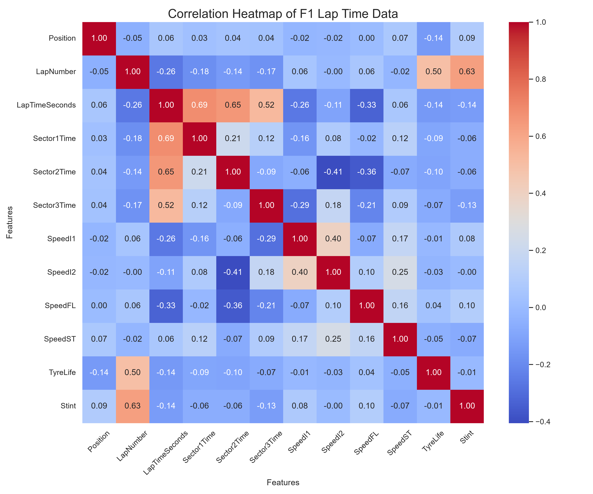

* **Sector Dominance:** Total lap time (`LapTimeSeconds`) exhibits strong positive linear correlations with individual sector splits: Sector 1 ($r = 0.69$), Sector 2 ($r = 0.65$), and Sector 3 ($r = 0.52$).
* **Speed Trap Inverse Relationship:** Speed traps (`SpeedI1`, `SpeedI2`, `SpeedFL`) show expected negative correlations with lap times (higher top speeds correspond to lower lap times, e.g., `SpeedFL` at $r = -0.33$).
* **Macro Race Progression:** Progression variables like `LapNumber` strongly correlate with stint progression (`Stint`, $r = 0.63$) and overall compound age (`TyreLife`, $r = 0.50$).
* **Multicollinearity Considerations:** High linear dependence between sector times and lap time reinforces the necessity of using `LapTimeDelta` as a stationary regression target rather than raw lap durations.

### 2.2 Tyre Degradation Curves

<table align="center" style="border: none;">
  <tr>
    <td align="center" width="33%">
      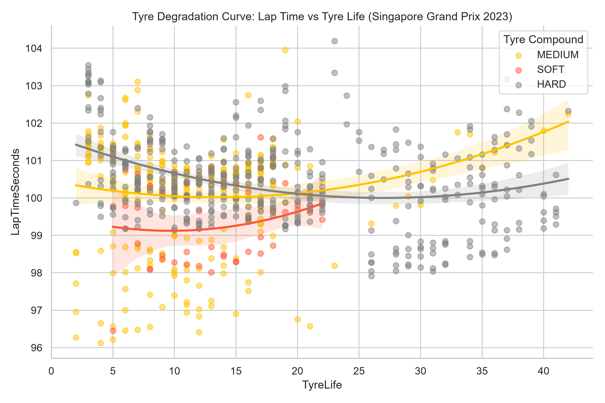 
      <b>Singapore GP (Street Track)</b>
    </td>
    <td align="center" width="33%">
      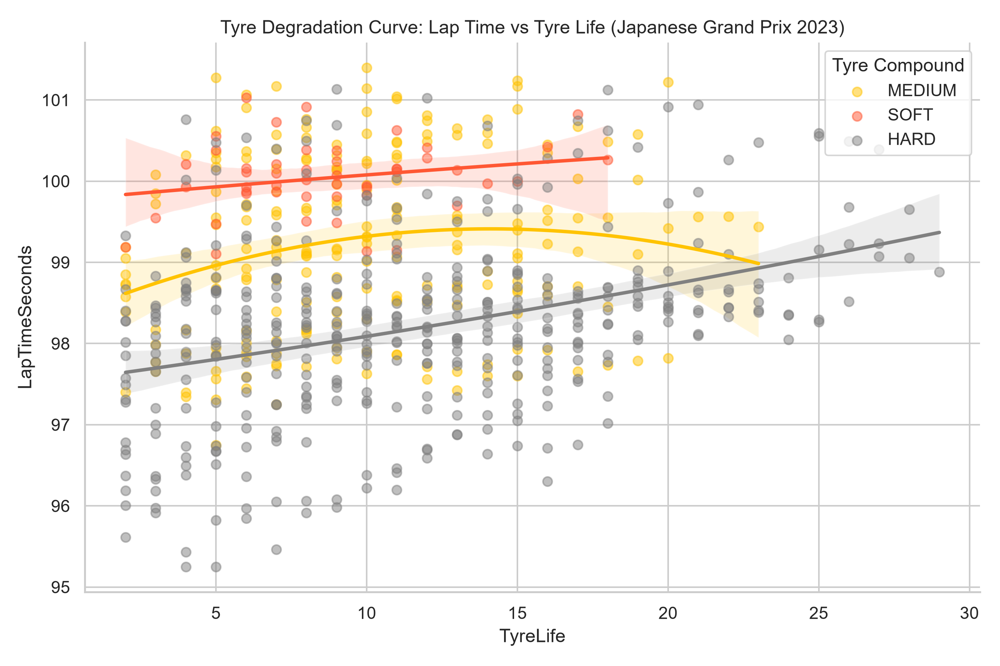 
      <b>Japanese GP (High Deg)</b>
    </td>
    <td align="center" width="33%">
      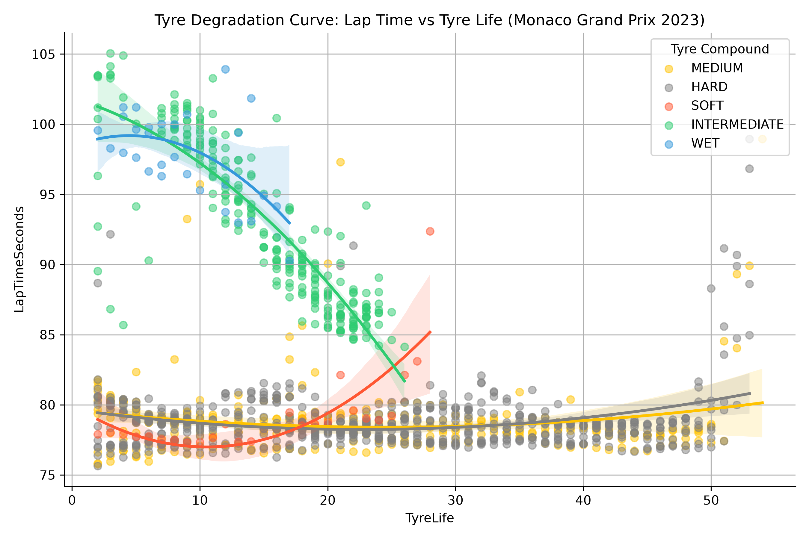 
      <b>Monaco GP (Wet / Low Deg)</b>
    </td>
  </tr>
</table>

* **Non-Linear Performance Decay:** Degradation does not follow a strict linear slope across circuits. Soft and Medium compounds experience distinct parabolic degradation curves, where initial fuel burn-off yields temporary pace improvements before thermal decay dominates.
* **Circuit-Specific Degradation Severity:** High-degradation tracks like Suzuka (Japan) display steep, monotonic pace loss on Soft and Medium tyres, whereas street circuits like Monaco exhibit flattened degradation curves across slick compounds.
* **Wet-Weather Discontinuities:** Transitions to wet compounds (`INTERMEDIATE` and `WET` in Monaco) create drastic lap-time shifts (spanning 10–15 seconds above dry baselines), underscoring the critical impact of track condition features during sequence modeling.

### 2.3 Driver and Team Performance Baselines

  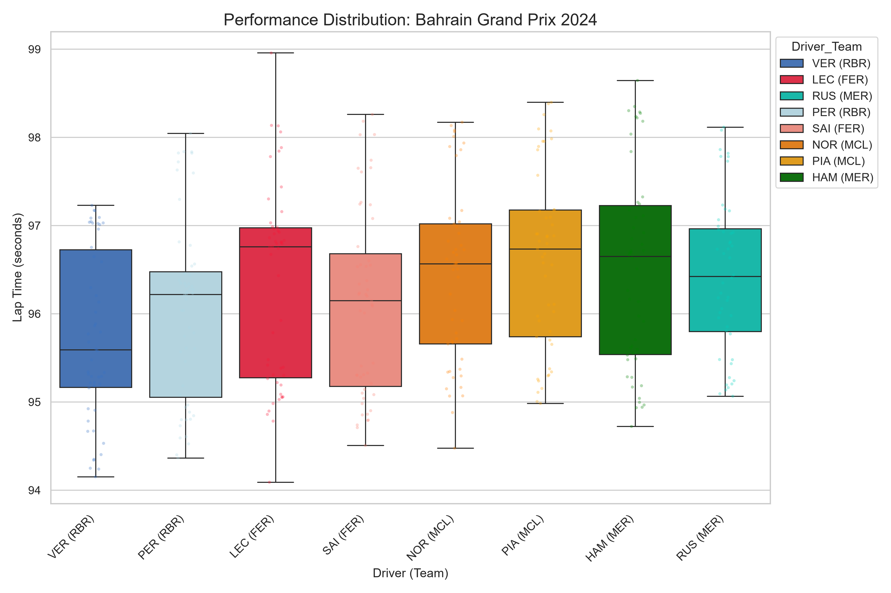

* **Hierarchical Performance Tiers:** Clear baseline speed offsets exist across constructers and drivers within identical sessions. Front-running teams like Red Bull (`VER`, `PER`) and Ferrari (`LEC`, `SAI`) maintain lower median lap-time distributions compared to midfield teams.
* **Intra-Team Variance:** Comparing teammates operating the same machinery highlights individual driver pace consistency. Interquartile ranges (IQR) demonstrate how driver consistency directly bounds lap-time dispersion under clean air conditions.
* **Categorical Embedding Rationale:** Significant structural variance between team/driver combinations confirms the necessity of entity embeddings (`Driver` and `Team`) in the feature set to allow the model to learn inherent machinery and driver offsets.

### 2.4 Sector Performance Heatmaps

<table align="center" style="border: none;">
  <tr>
    <td align="center" width="50%">
      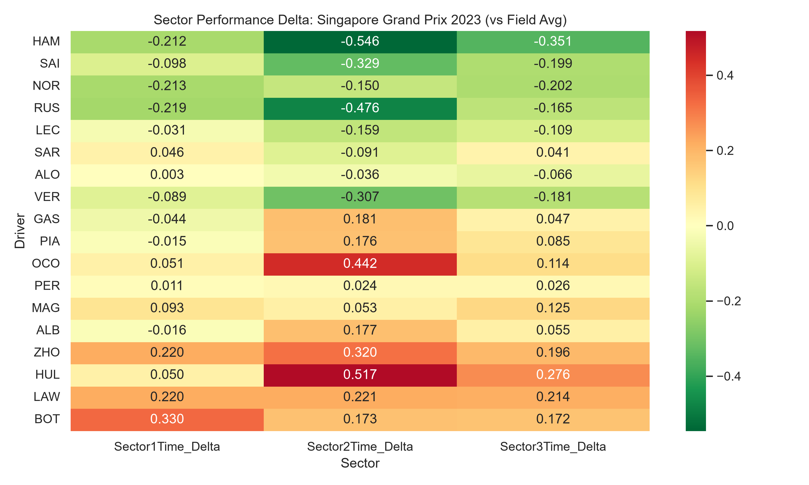 
      <b>Singapore GP 2023 Sector Performance Delta</b>
    </td>
    <td align="center" width="50%">
      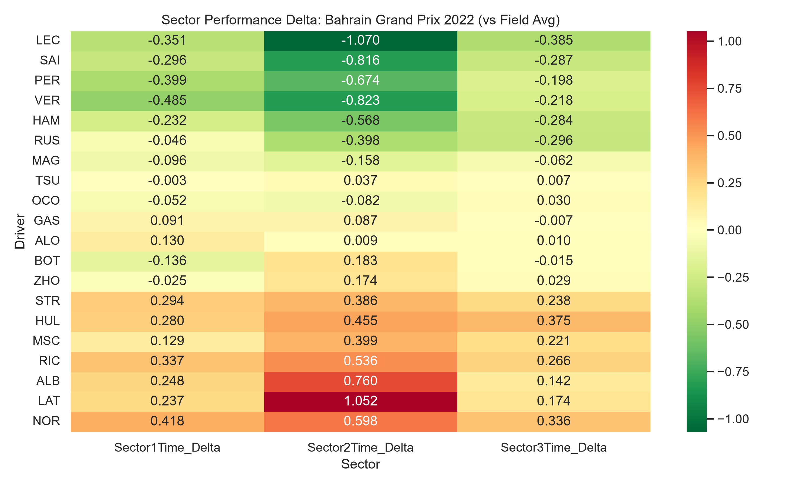 
      <b>Bahrain GP 2022 Sector Performance Delta</b>
    </td>
  </tr>
</table>

* **Aerodynamic vs. Power Trade-offs:** Relative sector performance deltas (measured against field averages) highlight specific car setup traits. For instance, high-downforce sectors display strong green deltas for specific constructors, whereas power-sensitive sectors reward low-drag setups.
* **Driver Skill Localization:** Sector-level heatmaps isolate localized driver strengths, showing how individual drivers gain or lose time in technical sector splits even when overall lap times remain competitive.
* **Sequence Input Value:** Including historical sector split deltas ($X_{\text{cont}}$) provides the LSTM encoder with localized performance signals prior to sequence generation.

### 2.5 Sector & Compound Thermal Dynamics

  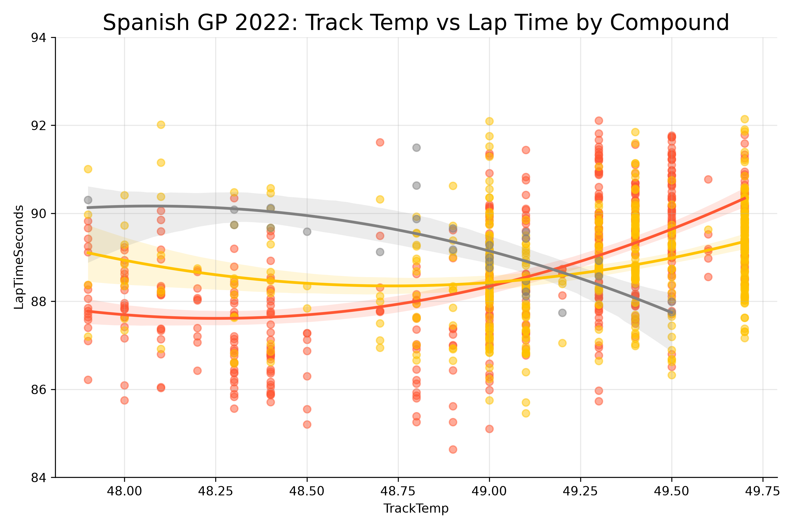

* **Thermal Sensitivity by Compound:** Track temperature fluctuations (`TrackTemp`) directly impact compound efficiency and lap times. Softer compounds exhibit higher sensitivity to elevated thermal levels, leading to accelerated degradation slopes.
* **Thermal Operating Windows:** As track temperature rises, harder compounds demonstrate greater pace stability, whereas softer compounds experience performance drops due to thermal overheating beyond their optimal operating window.
* **Dynamic Race Tracking:** Weather telemetry provides necessary environmental context to adjust baseline degradation expectations dynamically across multi-lap forecasts.
---

## 3. Feature Engineering & Preprocessing Architecture

### 3.1 Target Variable Definition & Bounded Transformations

<table align="center" style="border: none;">
  <tr>
    <td align="center" width="50%">
      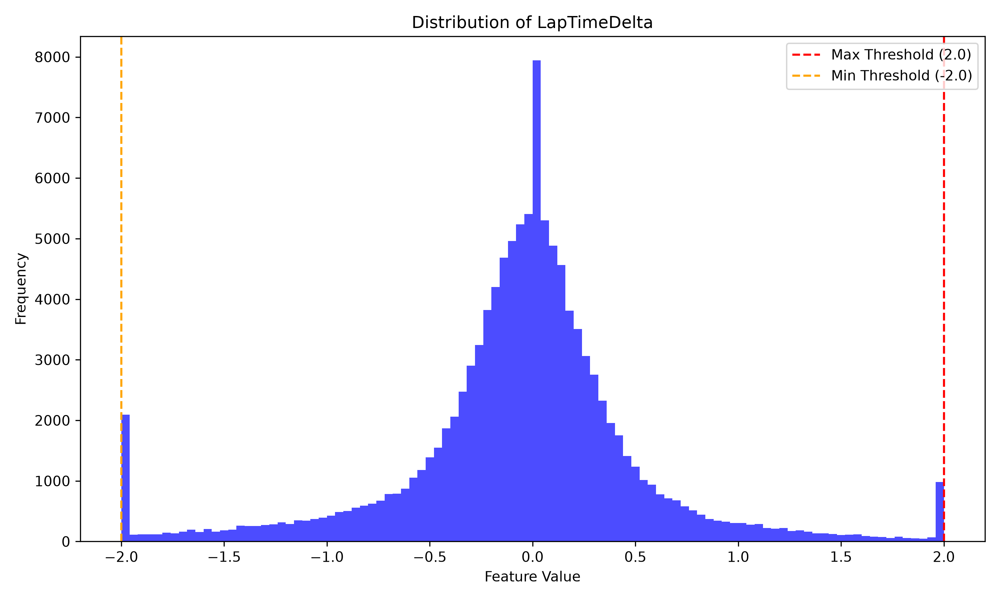 
      <b>Distribution & Thresholding of LapTimeDelta</b>
    </td>
    <td align="center" width="50%">
      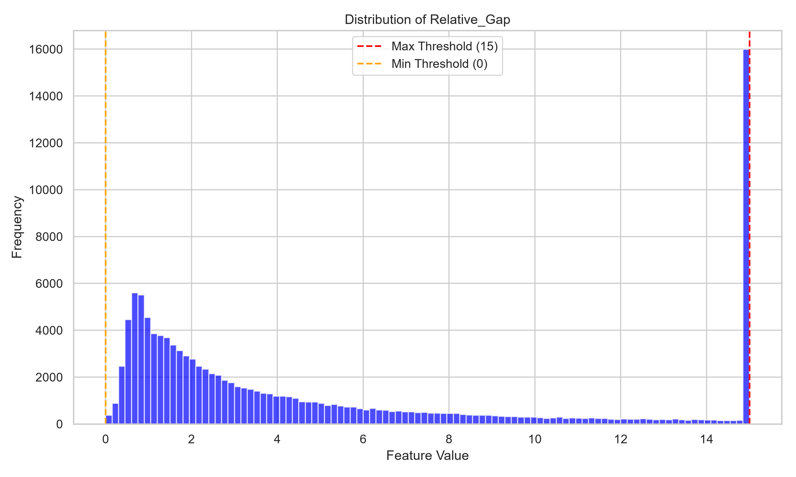 
      <b>Distribution & Thresholding of Relative Gap</b>
    </td>
  </tr>
</table>

* **Stationary Target (`LapTimeDelta`):** Raw lap time in seconds is highly non-stationary due to track layout differences across circuits. To create a universal target, `LapTimeDelta` is computed via step-wise differentiation ($\Delta t_i = t_i - t_{i-1}$) within each driver's stint. Extreme variance from lock-ups or minor traffic is bounded by clipping values to $[-5.0\text{s}, +5.0\text{s}]$.
* **Traffic & Aero Interactions (`Relative_Gap` & `DRS_Active`):** Vehicle interaction is modeled by measuring the time delta to the preceding car on track within each lap step. Cars leading in free air default to an unconstrained gap value before being clipped to a maximum upper boundary of $+15.0\text{s}$. A binary indicator `DRS_Active` flags laps where the gap falls within the regulatory $[0.0\text{s}, 1.0\text{s}]$ overtake window.
* **Non-Linear Tyre Degradation:** To support the neural network in learning non-linear tyre wear, polynomial feature expansion (${\text{TyreLife}}^2$) and stint progression counters (`Stint_Age`) are explicitly computed per stint.

### 3.2 Preprocessing & Feature Scaling Pipeline

  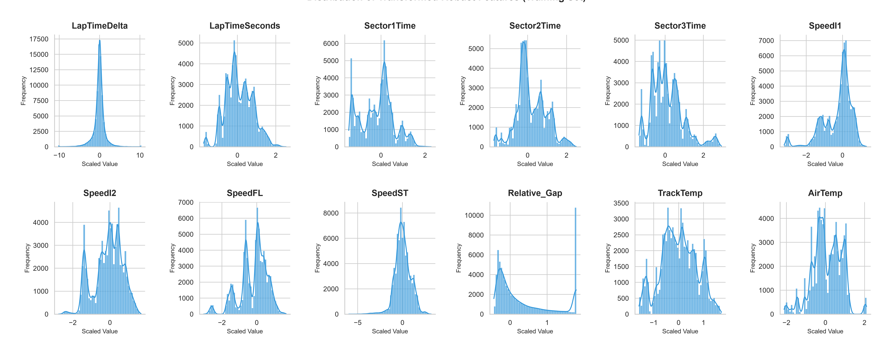

* **Robust Scaling Strategy:** Standard scaling is sensitive to heavy-tailed distributions caused by virtual safety cars or unexpected yellow flags. All continuous variables (`LapTimeDelta`, sector times, speed trap measurements, track temperatures, and relative gaps) are transformed using `RobustScaler` (centering by median and scaling by Interquartile Range) to preserve spatial variance without distortion.
* **Categorical Encoding Strategy:** High-cardinality categorical entities (`Driver`, `Team`, `Event`, `Compound`) are processed via Scikit-Learn pipelines to map ordinal integer IDs for downstream embedding layers in the LSTM architecture.
* **Sequence Alignment:** Post-transformation, time-series continuity is restored by sorting records chronologically by `[Year, Event, Driver, LapNumber]`, ensuring clean sequence tensor construction without data leakage.

### 3.3 Modular Preprocessing Class Architecture (`F1Preprocessor`)

* **Custom Pipeline Orchestration:** A dedicated `F1Preprocessor` encapsulates all encoding and normalization primitives into a unified execution framework, preventing data leakage by fitting continuous transformations exclusively on training sets while retaining global categorical mappings (`fit_categoricals`).
* **Dual Output Streams:** The preprocessor splits feature vectors into two distinct tensor structures: `transform_cat` outputs 2D integer arrays designated for embedding lookup tables, while `transform_cont` concatenates one-hot encoded, robustly scaled, min-max scaled, and boolean features into a dense float32 array.
* **Invertibility & Decoding:** Built-in inverse transformation routines (`inverse_transform_cat`, `inverse_transform_cont`) map scaled latent variables back to absolute lap times and physical telemetry units for downstream evaluation, sequence reconstruction, and error metrics calculation.

---

## 4. Sequence Modeling & Experimental Design

### 4.1 Temporal Splitting Strategy

To mirror realistic deployment conditions and avoid data leakage across race calendars, the dataset is partitioned chronologically by season:

* **Training Set (2020–2023):** Used for fitting preprocessing parameters (scalers/encoders) and training network weights across diverse aerodynamic regulations and weather conditions.
* **Validation Set (2024):** Utilized for hyperparameter tuning, early stopping, and selecting optimal sequence context lengths.
* **Test Set (2025):** Held out exclusively for out-of-sample benchmarking to evaluate long-horizon forecasting performance on unseen circuits and vehicle revisions.

### 4.2 PyTorch Sequence Dataset Architecture (`F1SequenceDataset`)

To handle multi-input sliding windows without incurring dynamic runtime overhead during training, dataset indices and future feature masks are calculated upfront.

* **Pre-Masked Lookahead Guard:** Features unavailable prior to lap execution (such as `LapTimeSeconds`, `Sector1Time`, `SpeedI1`, `Relative_Gap`, and `DRS_Active`) are isolated. These continuous signals are explicitly zero-masked (`0.0`) on a cloned future matrix tensor (`self.data_cont_fut`) during dataset initialization to prevent lookahead leakage during autoregressive decoding.

* **Session & Driver Boundary Validation:** The `_build_valid_indices` routine verifies that every sliding window of total length $L = \mathtt{seq\_len} + \mathtt{forecast\_len}$ shares identical session and driver metadata (`Year`, `Event`, `Driver`). Any window straddling different drivers, stints, or race events is discarded.

* **Zero-Copy Tensor Slicing:** Continuous features are stored as `float32` and categorical indices as `int64` tensors in memory. The `__getitem__` method executes slice operations directly on these tensor arrays:
  * `x_cat`, `x_cont`: Unmasked historical categorical and continuous sequences spanning `[start : end]`.
  * `x_cat_fut`, `x_cont_fut`: Future categorical features and pre-masked continuous features spanning `[end : future_end]`.
  * `y`: Ground truth target values (`LapTimeDelta`) spanning the forecast horizon `[end : future_end]`.

### 4.3 Sequence-to-Sequence Model Architecture (`F1LapSeq2Seq`)

The network uses an Encoder-Decoder LSTM architecture tailored for autoregressive multi-step lap time forecasting:

* **Categorical Embedding Fusion:** Entity embeddings for categorical inputs (`Year`, `Event`, `Driver`, `Team`) are computed via `nn.ModuleList` lookup tables and concatenated with continuous feature vectors ($X_{\text{cont}}$) prior to sequence encoding.
* **LSTM Encoder-Decoder Pipeline:** A multi-layer LSTM encoder processes historical lap sequences ($t = 1 \dots L_{\text{seq}}$) to compress historical driver pace, tyre degradation, and weather conditions into latent hidden and cell states $(h_t, c_t)$. The LSTM decoder initialized with these final states generates multi-step predictions step-by-step ($t = 1 \dots L_{\text{forecast}}$).
* **Autoregressive Decoding & Teacher Forcing:** During training, the decoder utilizes a scheduled linear teacher forcing decay ($\rho_{\text{start}} \to 0.2$) governed by $\rho(\text{epoch}) = \max(0.2, \rho_{\text{start}} - \frac{\text{epoch}}{0.8 \times \text{epochs}})$, combined with optional Gaussian noise injection ($\sigma_{\text{noise}}$) to mitigate exposure bias. The predicted delta output ($\hat{y}_{t-1}$) is detached and injected into the continuous feature vector (`target_cont_idx`) of the subsequent decoding time step $t$.

### 4.4 Training Optimization Setup

* **Robust Loss Function (`HuberLoss`):** Model parameters are optimized using Huber loss (Smooth L1 Loss with tunable $\delta$), combining $L_2$ squared error for small residuals with $L_1$ linear penalty for extreme outliers (such as pit stops or yellow flag delays).
* **Optimizer & Regularization (`AdamW`):** Weight updates are computed using the `AdamW` optimizer, incorporating explicit weight decay for parameter regularization along with dropout ($p = 0.3$) across multi-layer LSTM transitions.
* **Dynamic Learning Rate Scheduling (`ReduceLRONPlateau`):** Learning rate adjustments are managed dynamically via a plateau scheduler, monitoring validation loss performance to decay the learning rate by a scaling factor once loss plateauing occurs across successive epochs.

---

## 5. Baseline Model Performance & Evaluation

### 5.1 Convergence & Error Accumulation Analysis

  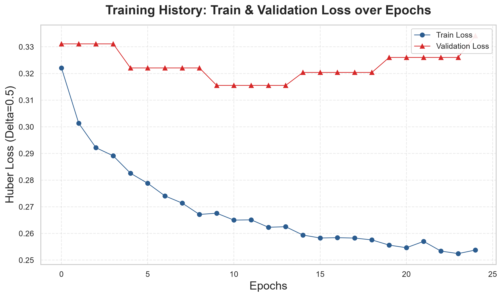 
  <b>Figure 5.1: Baseline Training and Validation Huber Loss Curves</b>

* **Training Dynamics & Early Overfitting:** As illustrated in **Figure 5.1**, training Huber loss smoothly decreases from $0.328$ to $0.256$. However, validation loss plateaus around epoch 5 ($0.329$) before experiencing divergence after epoch 18 ($>0.340$), indicating early overfitting and underscoring the necessity of systematic hyperparameter regularization (e.g., higher dropout rates, weight decay, and learning rate schedules).

  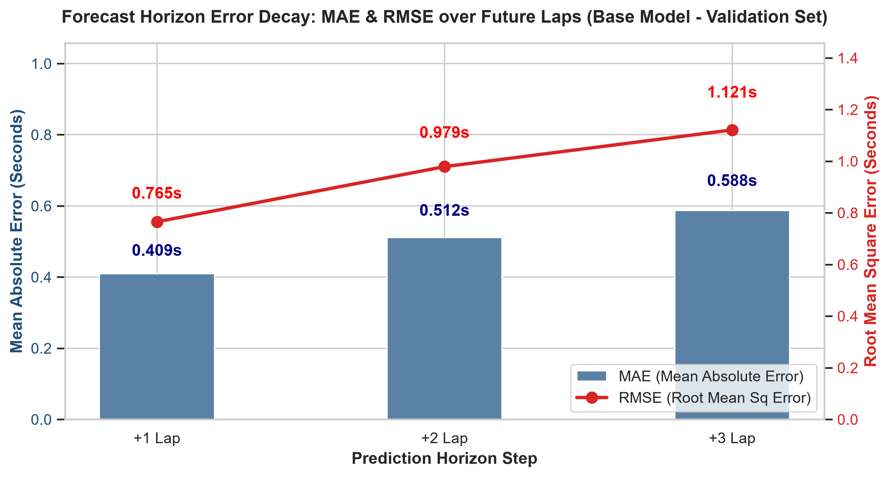 
  <b>Figure 5.2: Forecast Horizon Error Decay across Laps (+1 to +3 Laps)</b>

* **Multi-Step Horizon Degradation:** Figure 5.2 highlights the compound error accumulation intrinsic to autoregressive multi-step forecasting:
  * **+1 Lap Horizon:** Demonstrates strong immediate precision with an MAE of $\mathbf{0.435\text{s}}$ and RMSE of $\mathbf{0.815\text{s}}$.
  * **+2 Lap Horizon:** Errors escalate to an MAE of $\mathbf{0.535\text{s}}$ and RMSE of $\mathbf{0.997\text{s}}$.
  * **+3 Lap Horizon:** Degradation continues up to an MAE of $\mathbf{0.608\text{s}}$ and RMSE of $\mathbf{1.125\text{s}}$, driven by the feedback loop of model predictions into future time steps.

### 5.2 Qualitative Predictions & Residual Distribution

  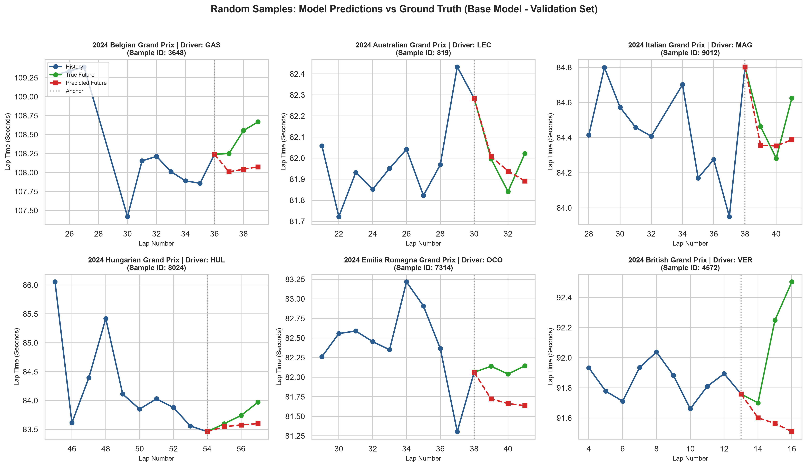 
  <b>Figure 5.3: Base Model Qualitative Trajectory Predictions vs. Ground Truth</b>

* **Qualitative Sample Inspection:** Across diverse Grand Prix samples (Figure 5.3), the baseline model closely tracks normal stint pacing trends (e.g., Leclerc at Albert Park, Magnussen at Monza). However, it struggles during sudden pace anomalies—such as Verstappen at Silverstone (+3 Lap pace sharp decline) or Hulkenberg at Hungary—where unexpected tire cliffing or traffic events introduce rapid non-linear changes.

  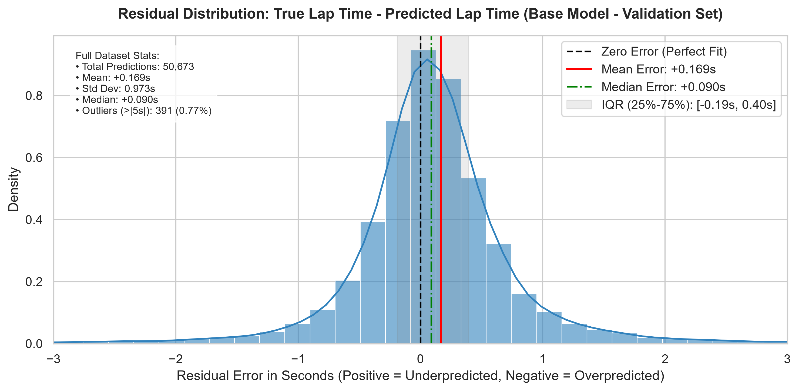 
  <b>Figure 5.4: Validation Set Residual Distribution Statistics</b>

* **Statistical Error Profiling:** Out of $50,673$ validation predictions (Figure 5.4), the residual error distribution yields a sharp central peak with an Interquartile Range (IQR) of $[-0.19\text{s}, +0.40\text{s}]$ and a median error of $+0.090\text{s}$. The slight positive mean error ($+0.169\text{s}$) reflects a mild tendency to slightly underpredict lap times during sudden lap slowdowns. Extreme outliers ($>|5\text{s}|$) account for only $0.77\%$ ($391$ samples) of all predictions, confirming robust outlier suppression via Huber loss.

---

## 6. Hyperparameter Optimization (Optuna)

To systematically navigate the multi-dimensional parameter landscape without prohibitive computational overhead, an automated hyperparameter search framework is executed using Optuna.

### 6.1 Two-Stage Search Strategy

To prevent sub-optimal coupling between model capacity and loss regularization, optimization is decoupled into a structured coarse-to-fine two-stage search strategy:

* **Stage 1: Architectural Exploration (Coarse Search):** Focuses on isolating optimal network capacity parameters (`hidden_dim`, `embed_dim`, `num_layers`, `learning_rate`). Regularization parameters (`dropout`, `weight_decay`, `HuberLoss_delta`) are fixed to mild baseline values ($0.2$, $1\times10^{-4}$, and $1.0$ respectively) to enable unconstrained gradient flow and identify high-performing baseline topologies.
* **Stage 2: Fine-Tuning & Regularization Optimization (Fine Search):** Freezes the optimal network architecture discovered in Stage 1 (`hidden_dim` = 64, `embed_dim` = 2, `num_layers` = 2). The search space then fine-tunes regularizers, loss sensitivity boundaries, and localized learning rate bounds to prevent overfitting and improve generalization on the 2024 validation set.

### 6.2 Hyperparameter Search Space Definition

| Optimization Stage | Hyperparameter | Search Space / Sampling Range | Selected Optimal Value |
| :--- | :--- | :--- | :--- |
| **Stage 1: Architecture** | `hidden_dim` | Categorical: `[32, 64, 128, 256]` | **`64`** |
| | `embed_dim` | Integer: `[2, 8]` (step = 2) | **`2`** |
| | `num_layers` | Integer: `[1, 3]` | **`2`** |
| | `learning_rate` | Log-Uniform Float: $1\times10^{-4}$ to $5\times10^{-3}$ | **`0.00118`** |
| **Stage 2: Fine-Tuning** | `dropout` | Uniform Float: $[0.2, 0.5]$ (step = 0.1) | **`0.30`** |
| | `weight_decay` | Log-Uniform Float: $[1\times10^{-5}, 1\times10^{-2}]$ | **`0.00909`** |
| | `HuberLoss_delta` | Uniform Float: $[0.3, 2.0]$ | **`0.3032`** |

* **Fixed Training Controls:** Across all trial evaluations, early stopping and learning rate plateau decay patience are set to $5$ epochs, with Gaussian noise injection $\sigma_{\text{noise}} = 0.02$ applied during autoregressive teacher forcing.

---

## 7. Tuned Model Evaluation & Results

### 7.1 Convergence & Error Accumulation Analysis

  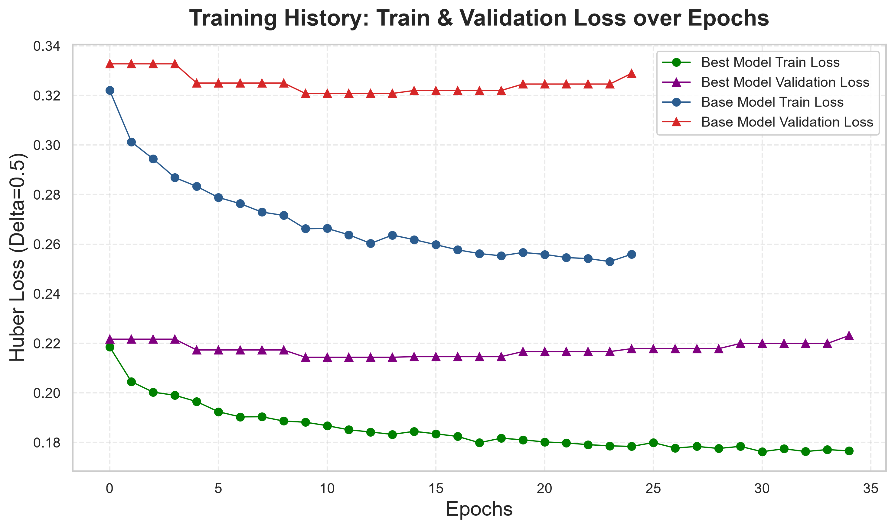 
  <b>Figure 7.1: Training and Validation Huber Loss Curves (Base Model vs. Tuned Model)</b>

* **Overfitting Elimination:** As shown in **Figure 7.1**, tuning suppresses the base model's validation loss divergence ($\approx 0.360$), maintaining a stable validation error around $\approx 0.223$.

* **Generalization Gap:** A moderate gap persists between training ($\approx 0.170$) and validation ($\approx 0.223$) loss, with optimal generalization peaking near epoch 10 ($\approx 0.215$) before slight plateauing.

### 7.2 Qualitative Predictions & Residual Distribution

   
  <b>Figure 7.2: Forecast Horizon Error Decay on Unseen 2025 Test Set (+1 to +3 Laps)</b>

* **Step-by-Step Error Breakdown:** Evaluated on unseen holdout data from the 2025 Grand Prix season (**Figure 7.2**), the tuned `F1LapSeq2Seq` architecture mitigates autoregressive error compounding:
  * **+1 Lap Horizon:** Achieves sub-second accuracy with an MAE of $\mathbf{0.333\text{s}}$ and RMSE of $\mathbf{0.561\text{s}}$ (improving upon the baseline's $0.435\text{s}$ MAE).
  * **+2 Lap Horizon:** Maintains strong predictive alignment with an MAE of $\mathbf{0.413\text{s}}$ and RMSE of $\mathbf{0.692\text{s}}$.
  * **+3 Lap Horizon:** Limits maximum degradation to an MAE of $\mathbf{0.474\text{s}}$ and RMSE of $\mathbf{0.782\text{s}}$ (compared to baseline's $0.608\text{s}$ MAE and $1.125\text{s}$ RMSE).

### 7.3 Qualitative Trajectory Analysis & Residual Profiling

   
  <b>Figure 7.3: Tuned Model Trajectory Predictions vs. Ground Truth Across 2025 Test Samples</b>

* **Pace & Stint Dynamics:** Qualitative evaluation across diverse 2025 race scenarios (**Figure 7.3**) confirms that the tuned model effectively predicts continuous tire degradation and pace stability (e.g., Leclerc at Abu Dhabi, Bearman at Singapore). Sudden, non-linear lap spikes (such as Piastri in Canada or Leclerc in Emilia Romagna) remain challenging due to unmodeled pit stops or traffic events, but predictions remain bounded.

   
  <b>Figure 7.4: Test Set Residual Distribution Statistics ($N = 47,025$)</b>

* **Statistical Residuals:** Statistical analysis across $47,025$ test predictions (**Figure 7.4**) highlights a highly centered error distribution:
  * **Unbiased Central Tendency:** Mean residual error reaches $\mathbf{+0.000\text{s}}$ (perfect unbiased mean fit) with a median of $\mathbf{-0.021\text{s}}$.
  * **Tight Prediction Interval:** The Interquartile Range (IQR) narrows to $[-0.26\text{s}, +0.24\text{s}]$, with standard deviation dropping from $0.973\text{s}$ (base) to $0.685\text{s}$.
  * **Outlier Minimization:** Extreme outliers ($>|5\text{s}|$) fall to just $\mathbf{0.22\%}$ ($104$ predictions), demonstrating the effectiveness of the optimized Huber Loss threshold ($\delta \approx 0.303$).

---

## 8. Feature Importance Analysis

To evaluate model interpretability and isolate key drivers behind sequence-to-sequence lap time forecasting, permutation feature importance is evaluated on the validation dataset by measuring the incremental Huber loss increase when individual features are randomly shuffled.

### 8.1 Overall Predictor Rankings

   
  <b>Figure 8.1: Top 15 Overall Permutation Feature Importances (Validation Set)</b>

As illustrated in **Figure 8.1**, model predictions are dominated by historical pace signals, circuit characteristics, and stint progression parameters:
* **Primary Pace Anchor:** `[Hist Cont] LapTimeDelta (Hist Target)` yields the highest loss impact ($\approx +0.081$), confirming that recent driver pace remains the primary baseline vector for multi-step extrapolation.
* **Circuit & Environmental Encoding:** `[Hist Cat] Event` serves as the second most critical predictor ($\approx +0.040$), reflecting track-specific lap length, layout characteristics, and ambient baseline pace differences.
* **Tire & Degradation Vectors:** Future stint dynamics (`[Fut Cont] Stint_Age`, `[Fut Cont] TyreLife`, and `[Fut Cont] Compound_INTERMEDIATE`) represent key future sequence signals, dictating non-linear lap time decay across the prediction horizon.

### 8.2 Historical Encoder & Future Decoder Feature Breakdown

  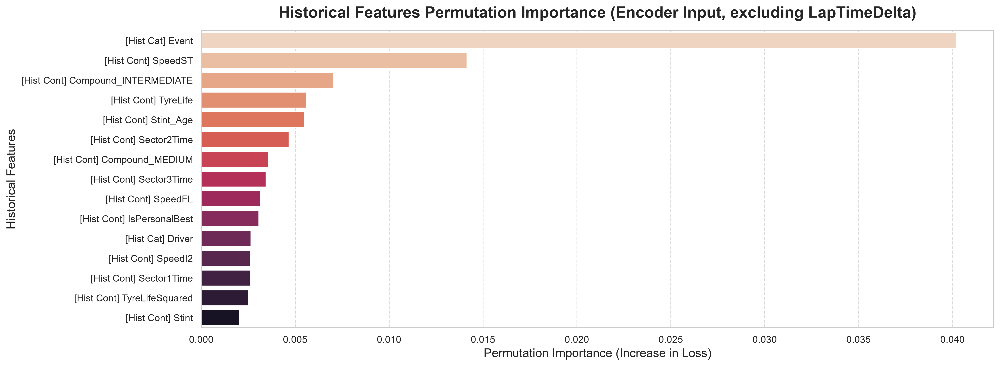 
  <b>Figure 8.2: Encoder Feature Importance (Historical Inputs, excluding LapTimeDelta)</b>

* **Encoder Domain Signatures (Figure 8.2):** Beyond event context (`Event`), straight-line speed (`SpeedST`) and wet/intermediate compound flags (`Compound_INTERMEDIATE`) drive historical sequence encoding. Sector-level splits (`Sector2Time`, `Sector3Time`) and driver identity (`Driver`) provide secondary stylistic and micro-sector pace corrections to the hidden state.

  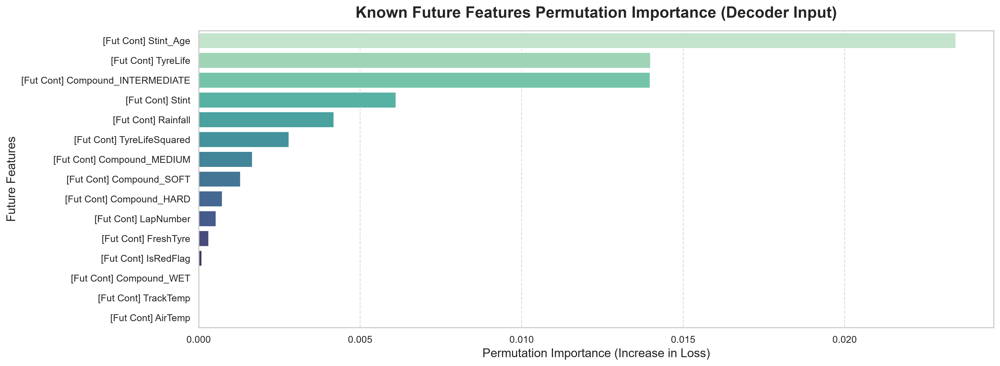 
  <b>Figure 8.3: Decoder Feature Importance (Known Future Inputs)</b>

* **Decoder Future Trajectory Inputs (Figure 8.3):** Known future inputs into the decoder LSTM are heavily governed by stint wear dynamics:
  * **Degradation Mechanics:** `Stint_Age` ($\approx +0.023$) and `TyreLife` ($\approx +0.014$) dominate future time steps, ensuring the decoder models progressive thermal and mechanical tire degradation.
  * **Compound & Weather Dynamics:** Crossover compounds (`Compound_INTERMEDIATE`) and environmental moisture (`Rainfall`) act as major non-linear pace modifiers during dynamic weather conditions.
  * **Low-Impact Features:** Static macro variables such as ambient temperatures (`AirTemp`, `TrackTemp`) and secondary compound flags (`Compound_WET`) exhibit minimal loss impact due to baseline normalisation across individual race stints.

---

## 9. Deployment & Application Architecture

To demonstrate real-time inference capabilities and enable interactive strategy simulation, the trained sequence-to-sequence model is deployed as a Web Application. The application features two operating modes:

### 9.1 Mode 1: Historical Prediction Explorer

The Historical Prediction Explorer allows users to benchmark model predictions against actual historical telemetry across holdout test sessions.

* **Session & Driver Selection:** Users can filter by Year, Event, Driver, and specific Lap Windows.
* **Interactive Visualizations:** Renders historical context laps alongside predicted multi-step lap trajectories and ground-truth values to highlight model accuracy in real-time.

   
  <b>Figure 9.1: Historical Prediction Explorer interface showing past sequence telemetry vs. ground truth forecast</b>

### 9.2 Mode 2: Custom Inference & Strategy Simulator

The Custom Inference Engine allows race engineers and strategists to simulate "what-if" racing scenarios by overriding telemetry parameters and environmental conditions.

* **Environmental & Race Setup:** Configurable parameters for Track Temperature, Air Temperature, and Rainfall status.
* **Track Status Controls:** Modeled track conditions such as Clean Track, Safety Car (SC), or Virtual Safety Car (VSC) transitions.
* **Telemetry & Strategy Customization:** Granular inputs for historical sector times, compound selection, tire age, and trap speeds, enabling real-time multi-lap strategy forecasting under hypothetical stint scenarios.

   
  <b>Figure 9.2: Custom Inference Engine interface for scenario modeling, weather adjustments, and tire strategy simulation</b>

---

## 10. Discussion & Future Improvements

### 10.1 Limitations & Edge Cases

* **Unpredicted Discontinuous Events:** Sudden external shocks—such as unexpected pit stops, mechanical failures, off-track excursions, or Safety Car deployments—cannot be anticipated strictly from prior telemetry vectors.
* **Traffic & Dirty Air Dynamics:** Scalar gap metrics struggle to resolve the localized, non-linear lap time degradation caused by multi-car battles and DRS trains.
* **Tire Degradation Non-Linearity:** Polynomial tire age features capture standard thermal wear well, but fail to predict sharp performance drops ("tire cliff") once critical thermal windows are exceeded.

### 10.2 Future Architecture Enhancements

* **Transformer & TFT Architectures:** Replace or hybridize LSTM layers with multi-head self-attention to capture long-range temporal dependencies across multi-stint histories.
* **Exogenous Event Probabilities:** Inject probabilistic event scores (e.g., Safety Car / VSC risk based on circuit history) directly into autoregressive decoding steps.
* **High-Frequency Telemetry Granularity:** Integrate micro-sector GPS data and per-lap pedal traces to expose driver tire management and corner-by-corner traffic constraints.
* **Multi-Agent Track Modeling:** Expand the single-driver sequence framework into a Graph Neural Network (GNN) to explicitly quantify dirty air penalties and overtaking constraints.